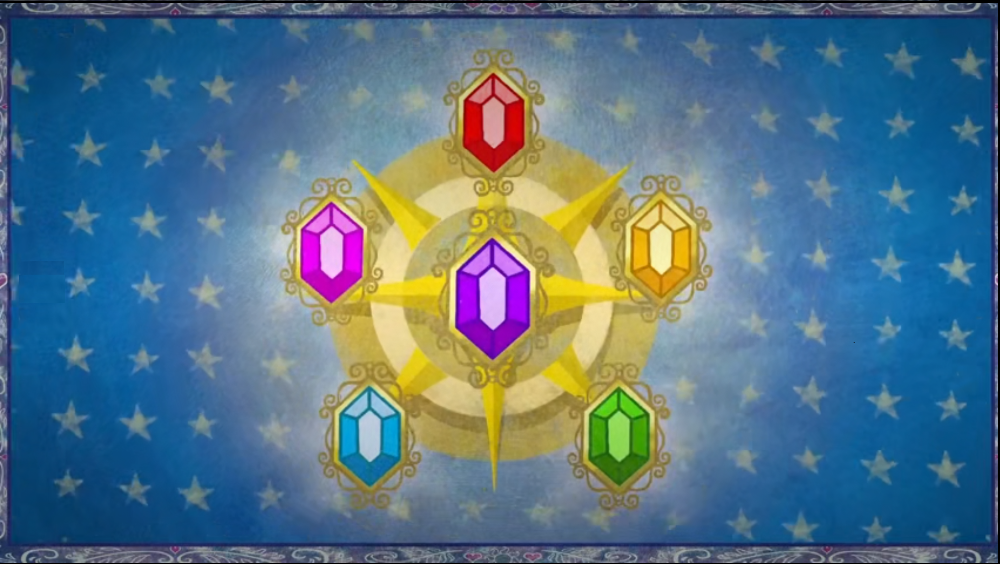

# 和谐之元

  
这是一个**我的世界模组**。  
向我的世界加入6个元素之后，你就可以用它们制造**更强大的**工具或武器。  
它们可以在世界中以**矿石**的形态找到，**熔炼**矿石以获得其它形态。  
永远**不可能**有太多的元素，如果数量够多，你甚至可以使用它们**超越生死**！  
它们可以有效地杀伤怪物，今后就在晚上随意出来游荡吧！  
最后，找到**和谐之树**，在哪里，你将会了解为什么，你，会在这个世界上……    
这就是**全部**吗？还是只是个**开始**呢？  

---
好，这个故事很荒唐，打住，到此结束。我们只是想制作一个有关**My Little Pony(R)**的模组。  

此模组正在开发，和**我的世界（Java版）1.15.2**以及**Forge 31.1.0**兼容。  

如果您在寻找以及开发完成且有关 **My Little Pony(R)**的模组，可以看看以下两个项目：  
- [Mine Little Pony](https://github.com/MineLittlePony/MineLittlePony) ，由 [Mine Little Pony](https://github.com/MineLittlePony) 开发的一个**Fabric模组**。（我试过了，**超级**酷！）
- [Love and Tolerance](https://github.com/Love-and-Tolerance/Love-and-Tolerance) ，由 [Love and Tolerance](https://github.com/Love-and-Tolerance) 制作的材质包。（非常**漂亮**！）

一开始我们准备使用Fabric以便和他们兼容，但看完文档后程序猿崩溃了，决定继续使用Forge……  

---
运行环境：  
- 我的世界1.15.2（Java版），且已安装Forge31.1.0。

---
开源许可证：
（翻译后的英文版GNU通用公共许可证可能失去法律效力，请**务必阅读**仓库中内置的**英文原版**LICENSE文件以了解相关权利和义务！）  
此模组和一份GNU通用公共许可证（版本3.0）共同发行。  

这个程序属于自由软件：你可以重新发布和/或修改它，只要遵循GNU通用公共许可证的相关条款以及许可的第三版，或（根据您的选择）任何更新版本。  
开发者分发这个程序是希望它会有用，但不包含任何保证；甚至连默示保证都没有。无法保证**适销性**或**适合某一特定目的**。请参阅**GNU通用公共许可证**以获取更多细节。  
你应该已经收到一份GNU通用公共许可证的副本和这个程序一起。如果没有，请参见<https://www.gnu.org/licenses/>。  

（“许可证”章节中的内容系机器翻译。）

---
开发人员：  
- [Andy K Sparklight](https://github.com/Andy-K-Sparklight) ，可在 [**XUOGROUP**](https://www.xuogroup.top)中叫TA *Andy*。    

---
文档结束了，感谢你的阅读！    
我们珍惜每个人的意见，如果您发现问题或者有改进计划，请不吝提出**Issue**或**Pull Request**。    

---
*My Little Pony(R)* 是**美国孩之宝公司**的商标或注册商标。  
